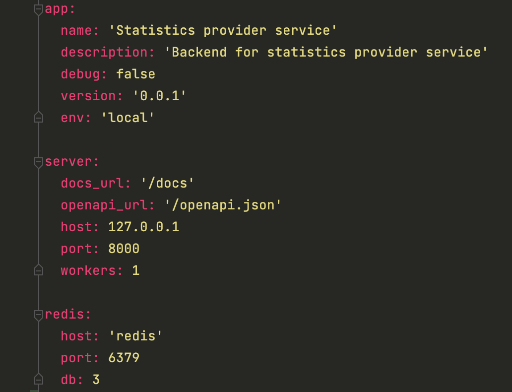
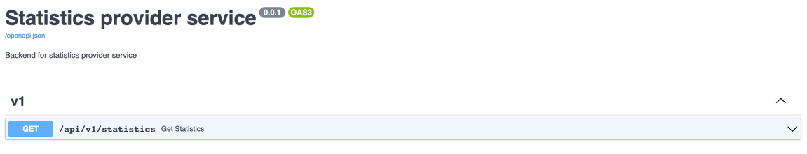

# Statistics provider service
Сервис выдачи информационных данных для виджетов.

<br>

# Run in Docker [recommended]
```
git clone git@github.com:kirakulakov/wbmp_redis_stat.git \
&& cd wbmp_redis_stat \
&& docker compose up --build
```

<br>

# Local run
#### Клонировать репозиторий и перейти в директорию с проектом
```
git clone git@github.com:kirakulakov/wbmp_redis_stat.git \
&& cd wbmp_redis_stat
```

#### В app/configs/local.yaml в случае необходимости настроить конфиги для локального развертывания



#### Создать виртуальное окружение и установить зависимости
```
python3.[10 recommended] -m venv venv && . ./venv/bin/activate && pip install -r requirements.txt
```

#### Запуск тестов
```
pytest app
```

#### Запуск сервиса
```
python run.py
```

<br>

# swagger-docs


